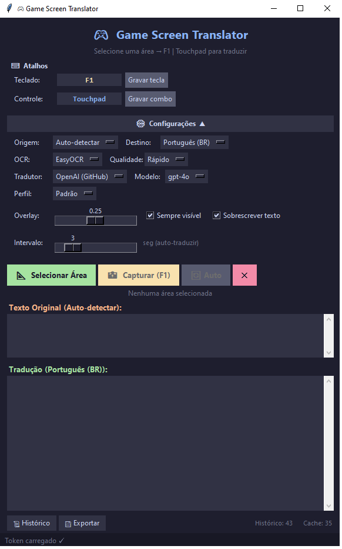

# 🎮 Game Screen Translator

Tradutor de tela em tempo real para jogos. Captura uma área da tela, reconhece o texto via OCR e traduz entre **qualquer par de idiomas** usando múltiplos motores de tradução.




## Funcionalidades

- **Seleção de área** estilo Lightshot — arraste um retângulo na tela
- **Múltiplas áreas de captura** simultâneas com overlays coloridos
- **Múltiplos motores de OCR**: EasyOCR, Tesseract, RapidOCR, PaddleOCR
- **Qualidade de OCR configurável**: Rápido, Balanceado, Qualidade (presets de pré-processamento)
- **Tradução multi-idioma** com detecção automática de idioma fonte
- **3 motores de tradução**: OpenAI (GitHub Models), Google Translate (deep-translator), MarianMT (offline)
- **Cache de traduções** persistente (LRU, até 500 entradas) — evita chamadas repetidas à API
- **Histórico de traduções** com exportação em JSON/CSV
- **Tradução automática** com detecção de mudanças na tela e intervalo configurável
- **Overlay de texto** sobre a área do jogo (sobrescreve diálogo original)
- **Hotkey configurável** (padrão: F1)
- **Suporte a gamepad** — DualSense/DS4 com combo de botões configurável
- **Overlay click-through** com transparência ajustável
- **Perfis de jogo**: Padrão, Jogos Retro, Jogos Modernos, Visual Novel, JRPG
- **Logging estruturado** em arquivo + console
- **Tratamento de erros** com logging de exceções fatais
- **Degradação graciosa** — funciona mesmo sem dependências opcionais instaladas

## Idiomas Suportados

| Código   | Idioma            |
|----------|-------------------|
| `auto`   | Auto-detectar     |
| `en`     | English           |
| `pt-br`  | Português (BR)    |
| `es`     | Español           |
| `fr`     | Français          |
| `de`     | Deutsch           |
| `it`     | Italiano          |
| `ja`     | 日本語            |
| `ko`     | 한국어            |
| `zh-cn`  | 中文 (简体)       |
| `zh-tw`  | 中文 (繁體)       |
| `ru`     | Русский           |
| `pl`     | Polski            |
| `nl`     | Nederlands        |
| `tr`     | Türkçe            |

## Requisitos

- Python 3.10+
- [GitHub Token](https://github.com/settings/tokens) com acesso à API de Models (para motor OpenAI)

## Instalação

```bash
pip install -r requirements.txt
```

### Dependências Opcionais

Descomente no `requirements.txt` conforme necessário:

| Pacote                  | Uso                                  |
|-------------------------|--------------------------------------|
| `pytesseract`           | Motor OCR Tesseract                  |
| `rapidocr-onnxruntime`  | Motor OCR RapidOCR (rápido/leve)     |
| `paddleocr`+`paddlepaddle` | Motor OCR PaddleOCR               |
| `transformers`+`sentencepiece` | Tradução offline MarianMT      |

## Configuração

Crie um arquivo `.env` na raiz do projeto:

```
GITHUB_TOKEN=seu_token_aqui
```

### config.json

As configurações são salvas automaticamente em `config.json`:

```json
{
  "keyboard_hotkey": "f1",
  "gamepad_buttons": [15],
  "gamepad_enabled": true,
  "source_language": "auto",
  "target_language": "pt-br",
  "ocr_engine": "easyocr",
  "ocr_quality": "fast",
  "translation_engine": "openai",
  "api_model": "gpt-4o",
  "overlay_alpha": 0.25,
  "overlay_always_visible": true,
  "auto_translate": false,
  "auto_translate_interval": 3,
  "active_profile": "default",
  "text_overlay": true
}
```

## Uso

```bash
python translator.py
```

1. Clique em **Selecionar Área** e arraste sobre a caixa de diálogo do jogo
2. Pressione **F1** (ou a tecla configurada) para capturar e traduzir
3. O texto original e a tradução aparecem na janela
4. (Opcional) Ative a **tradução automática** para detectar mudanças na tela automaticamente

### Atalhos

| Entrada | Ação |
|---------|------|
| F1 (configurável) | Capturar + traduzir |
| Botão do controle (configurável) | Capturar + traduzir |
| ESC (durante seleção) | Cancelar seleção |

### Motores de Tradução

| Motor               | Descrição                              | Requer Internet |
|----------------------|----------------------------------------|:--------------:|
| OpenAI (GitHub)      | GPT-4o/4o-mini via Azure — alta qualidade, corrige OCR | Sim |
| Google Translate     | Via deep-translator — rápido, gratuito | Sim |
| MarianMT (offline)   | Helsinki-NLP/Hugging Face — sem internet | Não |

### Perfis de Jogo

| Perfil          | OCR         | Idioma Fonte | Modelo      |
|-----------------|-------------|:------------:|-------------|
| Padrão          | Balanceado  | Auto         | gpt-4o-mini |
| Jogos Retro     | Qualidade   | EN           | gpt-4o-mini |
| Jogos Modernos  | Balanceado  | Auto         | gpt-4o-mini |
| Visual Novel    | Rápido      | JA           | gpt-4o      |
| JRPG            | Balanceado  | JA           | gpt-4o-mini |

## Estrutura do Projeto

```
├── translator.py              # Entry point + logging + DPI awareness
├── config.json                # Configurações persistidas (gerado automaticamente)
├── translation_cache.json     # Cache de traduções (gerado automaticamente)
├── translation_history.json   # Histórico de traduções (gerado automaticamente)
├── translator.log             # Log da aplicação (gerado automaticamente)
├── requirements.txt           # Dependências (obrigatórias + opcionais)
├── .env                       # Token GitHub (criado pelo usuário)
└── app/
    ├── __init__.py
    ├── config.py              # Configurações, idiomas, presets, perfis, constantes
    ├── ocr.py                 # Multi-engine OCR + pré-processamento de imagem
    ├── translation.py         # Multi-engine tradução + prompts + cache integration
    ├── cache.py               # Cache LRU persistente (SHA-256 keyed)
    ├── history.py             # Histórico de traduções + exportação JSON/CSV
    ├── input.py               # Teclado (pynput) + gamepad (pygame)
    ├── overlay.py             # Seleção de área + overlay + text overlay
    └── gui.py                 # Interface gráfica completa (Tkinter, tema Catppuccin)
```

## Changelog

### v2.0 — 2026-02-16

#### Novos Módulos
- **`app/cache.py`** — Cache de traduções persistente com política LRU (até 500 entradas), chaves SHA-256, persistência em `translation_cache.json`
- **`app/history.py`** — Histórico de traduções com limite de 200 entradas, exportação para JSON e CSV, persistência em `translation_history.json`

#### Tradução (`app/translation.py`)
- Suporte a **3 motores de tradução**: OpenAI (GitHub Models), Google Translate (deep-translator), MarianMT (offline/Hugging Face)
- **Detecção automática de idioma** fonte com prompt dedicado (`DETECT_PROMPT`)
- **Tradução multi-idioma** — qualquer par de idiomas (antes: apenas EN → PT-BR)
- **Prompts dinâmicos** com templates parametrizados por idioma fonte/destino
- **Integração com cache** — consulta antes de chamar API, armazena resultado após tradução
- **Degradação graciosa** — imports opcionais com flags (`OPENAI_AVAILABLE`, `DEEP_TRANSLATOR_AVAILABLE`, `MARIAN_AVAILABLE`)
- Método `configure()` para alterar engine/modelo/idiomas em tempo de execução
- Método `available_engines()` para listar motores instalados
- Logging detalhado em todas as operações

#### OCR (`app/ocr.py`)
- Suporte a **4 motores de OCR**: EasyOCR, Tesseract, RapidOCR, PaddleOCR
- **Fallback automático** entre engines se a selecionada não estiver disponível
- **Presets de qualidade** (Rápido/Balanceado/Qualidade) com parâmetros de pré-processamento
- Suporte a múltiplos idiomas OCR (mapeamento para cada engine)
- Detecção de GPU para EasyOCR
- Método `available_engines()` para listar engines instaladas

#### Configuração (`app/config.py`)
- **15 idiomas** suportados com mapeamento para cada engine OCR
- **5 perfis de jogo** pré-definidos (Padrão, Retro, Moderno, Visual Novel, JRPG)
- **Mapas de modelos MarianMT** para pares de idiomas
- **3 presets de qualidade OCR** com parâmetros detalhados
- **5 modelos de API** disponíveis (gpt-4o-mini, gpt-4o, gpt-4, gpt-3.5-turbo, o3-mini)
- Mapas de engines de tradução e OCR
- Classe `Config` com persistência JSON, aplicação de perfis, helpers

#### Interface (`app/gui.py`)
- **Painel de configurações** expansível com dropdowns para: idioma fonte/destino, engine OCR, qualidade, engine de tradução, modelo API, perfil de jogo
- **Tradução automática** com detecção de mudanças na tela via hash MD5, intervalo de estabilidade configurável
- **Text overlay** — exibe tradução diretamente sobre a área do jogo
- **Múltiplas áreas de captura** com overlays coloridos (até 5 cores)
- **Histórico visual** em janela separada com timeline
- **Exportação** de traduções para JSON/CSV via dialog
- **Barra inferior** com contadores de cache e histórico
- **Transparência do overlay** ajustável via slider (0.01–0.50)
- Tema **Catppuccin Mocha** consistente

#### Entry Point (`translator.py`)
- **Logging estruturado** em arquivo (`translator.log`) + console com timestamps
- **Tratamento de erros fatais** com `logger.exception()`
- Mensagem de inicialização com timestamp

#### Configuração (`config.json`)
- Novas chaves: `source_language`, `target_language`, `ocr_engine`, `ocr_quality`, `translation_engine`, `api_model`, `overlay_alpha`, `overlay_always_visible`, `auto_translate`, `auto_translate_interval`, `active_profile`, `text_overlay`

#### Dependências (`requirements.txt`)
- Adicionado `deep-translator` (obrigatório)
- Adicionadas dependências opcionais comentadas: `pytesseract`, `rapidocr-onnxruntime`, `paddleocr`/`paddlepaddle`, `transformers`/`sentencepiece`

## Licença

MIT
