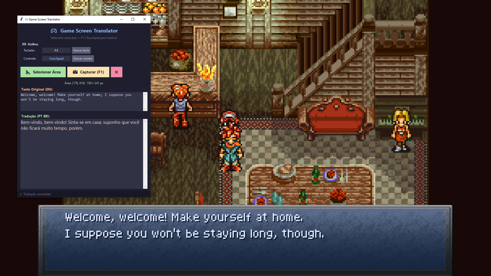
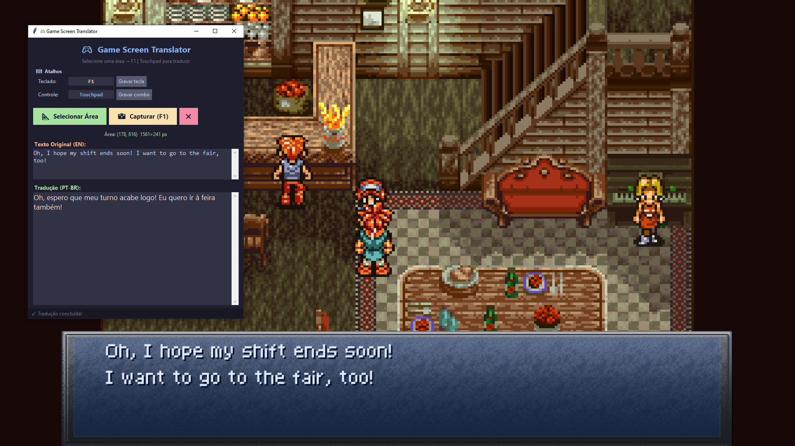

# 🎮 Game Screen Translator

Tradutor de tela em tempo real para jogos. Captura uma área da tela, reconhece o texto via OCR e traduz de **inglês para português brasileiro** usando a API do GitHub Models (GPT-4o-mini).




## Funcionalidades

- **Seleção de área** estilo Lightshot — arraste um retângulo na tela
- **OCR otimizado** para pixel art (SNES, GBA, etc.) com EasyOCR
- **Tradução EN → PT-BR** com correção automática de erros de OCR
- **Hotkey configurável** (padrão: F1)
- **Suporte a gamepad** — DualSense/DS4 com combo de botões configurável
- **Overlay click-through** sobre a área monitorada

## Requisitos

- Python 3.10+
- [GitHub Token](https://github.com/settings/tokens) com acesso à API de Models


## Configuração

Crie um arquivo `.env` na raiz do projeto:

```
GITHUB_TOKEN=seu_token_aqui
```

## Uso

```bash
python translator.py
```

1. Clique em **Selecionar Área** e arraste sobre a caixa de diálogo do jogo
2. Pressione **F1** (ou a tecla configurada) para capturar e traduzir
3. O texto original e a tradução aparecem na janela

### Atalhos

| Entrada | Ação |
|---------|------|
| F1 (configurável) | Capturar + traduzir |
| Botão do controle (configurável) | Capturar + traduzir |
| ESC (durante seleção) | Cancelar seleção |

## Estrutura do Projeto

```
├── translator.py        # Entry point
├── config.json          # Configurações salvas
├── requirements.txt     # Dependências
└── app/
    ├── config.py        # Gerenciamento de configurações
    ├── ocr.py           # Engine OCR + pré-processamento
    ├── translation.py   # Serviço de tradução (OpenAI)
    ├── input.py         # Teclado + gamepad
    ├── overlay.py       # Seleção de área + overlay
    └── gui.py           # Interface gráfica (Tkinter)
```

## Licença

MIT
